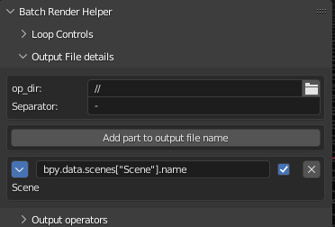
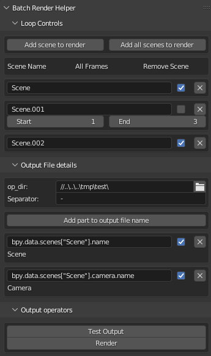

# Batch Render Helper:

Simple UI to help with local render file naming.

# Installation:


Located in testing section of addons.

# Panel layout:


The BR Helper tab will be located in the 3d Viewport UI (N-panel) section.

It consists of 3 portions:
* Loop Controls: Where you define which scenes and frame ranges you want to render.
* Output File details: Where you provide an output folder, and setup the naming format of your files.
* Output operators: Contains a Test and Render operator.

# Loop Controls:


Beginning with 2 simple operators you can easily add which scenes of the current blend file to render by adding the current scene or simply adding all scenes within the file.


Once scenes are added you can select the check box to render all frames in a scene, uncheck to select a start and end frame range, or click the x to remove the scene from the render queue.

# Output file details:


Beginning with a selection of the ouput file folder and a seperator you can quickly build your desired filename structure here. If your Blend file is already saved the default '//' output directory will be the same directory as your blend file. By default all files will at a minimum include the frame number from the render to avoid accidental overwriting of the a render.

Adding fields to the file name:


Once a field is added you can either simply type in a fixed text string or copy a full data path of a scene property to be used.


Once a full data path is copied into a field use the check box to enable evaluation of the field. If the field is properly evaluated the selected property should show directly below in a user friendly format like where the data path was copied from.



# Potential Gotcha's:


Some fields like the active camera selection will show a pointer address instead of a simple string name. This is not an error as the field is a pointer to the object not the objects name. 


To correct this simply add '.name' to the end of the data path previously copied the underlying evaluated property now displays the intended result.

# Output Operators:


The Test output function allows you to verify all filenames that will be used prior to any render. 


Simply open a text editor window and use the dropdown selection to view/review the generated file name format.

```txt
//simple text-Scene-Camera-1.png
//simple text-Scene-Camera-2.png
//simple text-Scene-Camera-3.png
//simple text-Scene-Camera-4.png
//simple text-Scene-Camera-5.png
//simple text-Scene.001-Camera.001-1.png
//simple text-Scene.001-Camera.001-2.png
//simple text-Scene.001-Camera.001-3.png
//simple text-Scene.002-Camera.002-1.png
//simple text-Scene.002-Camera.002-2.png
//simple text-Scene.002-Camera.002-3.png
//simple text-Scene.002-Camera.002-4.png
//simple text-Scene.002-Camera.002-5.png
//simple text-Scene.003-Camera.003-3.png
//simple text-Scene.003-Camera.003-4.png
//simple text-Scene.003-Camera.003-5.png
//simple text-Scene.004-Camera.004-1.png
//simple text-Scene.004-Camera.004-2.png
//simple text-Scene.004-Camera.004-3.png
//simple text-Scene.004-Camera.004-4.png
//simple text-Scene.004-Camera.004-5.png
```

You can now see that each scene, camera, and frame range are properly identified (even though the selections were made in a specific scene) as well as the default file directory. If you identify something you wish to change simply add, modify or remove in the panel in the 3d viewport and verify by running the test again overwriting the existing text editor file.



```txt
//..\..\..\tmp\test\Scene-Camera-1.png
//..\..\..\tmp\test\Scene-Camera-2.png
//..\..\..\tmp\test\Scene-Camera-3.png
//..\..\..\tmp\test\Scene-Camera-4.png
//..\..\..\tmp\test\Scene-Camera-5.png
//..\..\..\tmp\test\Scene.001-Camera.001-1.png
//..\..\..\tmp\test\Scene.001-Camera.001-2.png
//..\..\..\tmp\test\Scene.001-Camera.001-3.png
//..\..\..\tmp\test\Scene.002-Camera.002-1.png
//..\..\..\tmp\test\Scene.002-Camera.002-2.png
//..\..\..\tmp\test\Scene.002-Camera.002-3.png
//..\..\..\tmp\test\Scene.002-Camera.002-4.png
//..\..\..\tmp\test\Scene.002-Camera.002-5.png
```

When satisfied use the render operator to begin rendering.
