# Batch Render Helper:

Simple UI to help with local render file naming. For a more robust solution consider supporting Render+ available at BlenderMarket. The Tutorials provided by https://sinestesia.co/ have assisted in the creation of this add-on.

# Contents

1. [Installation](#installation)
2. [Panel Layout](#panel-layout)
    * [Scene Controls](#scene-controls)
    * [Output file details](#output-file-details)
    * [Output Operators](#output-operators)
3. [Basic Operation](#basic-operation)
    * [Setting Scene Controls](#setting-scene-controls)
    * [Defining File Name Structure](#defining-file-name-structure)
    * [Testing Output](#testing-output)
    * [Performing Render](#performing-render)
4. [Intermediate Operation](#intermediate-operation)
    * [Background Rendering](#background-rendering)
5. [Advanced Operation](#advanced-operation)
    * [Potential Gotcha's](#potential-gotchas)
6. [Change Log](#change-log)

# Installation:

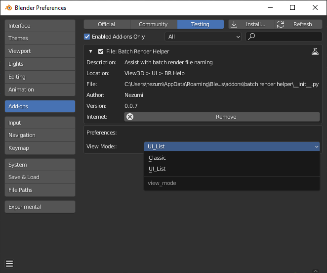

* Download `.zip` file.
* From the `Edit` menu select `Preferences` > `Add-ons`.
* In the preferences panel select install and browse to the `batch render helper.zip` file.
* The add-on can be found in the `Community` section. Filtered on File (or User for blender 3.6.1)
* The `View Mode` selection determines panel style.


[Back to Contents](#contents)

# Panel layout:

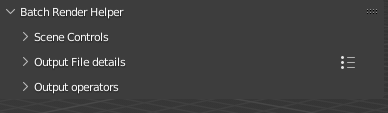

The BR Helper tab will be located in the 3d Viewport UI (N-panel) section.

It consists of 3 portions:
* Scene Controls: Where you define which scenes and frame ranges you want to render.
* Output File details: Where you provide an output folder, and setup the naming format of your files.
* Output operators: Containing a Test and Render operator.

[Back to Contents](#contents)

# Scene Controls:

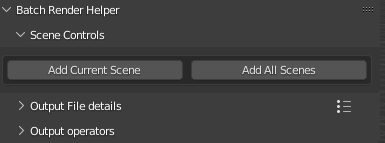

Beginning with 2 simple operators you can easily add which scenes of the current blend file to render by adding the current scene or simply adding all scenes within the file.

[Back to Contents](#contents)

# Output file details:

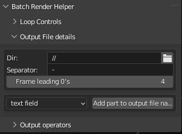

Beginning with a selection of the output file folder and a separator you can quickly build your desired filename structure here. If your Blend file is already saved the default '//' output directory will be the same directory as your blend file.

[Back to Contents](#contents)

# Output Operators:

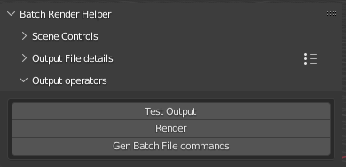

The `Test Output` operator allows you to verify all filenames that will be used prior to any render.
The `Render` operator begins rendering all selected frames. The `Gen Batch File Commands` operator will create the basic commands required for performing a background render.

[Back to Contents](#contents)

# Basic Operation

# Setting Scene Controls

After adding 1 or more scenes to be rendered:

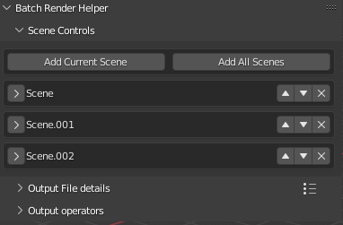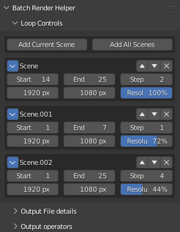

* The arrow on the left side enables expanding and collapsing of available options per scene.
* This is followed by the scene name.
* The up and down triangles allow for re-arranging items in list.
* The `X` will remove the scene from the list.
* If the scene's details are expanded they can directly control the start, end, and frame step of each scene without having to change scenes. As well as the resolution x, y, and percent.

[Back to Contents](#contents)

# Defining File Name Structure:

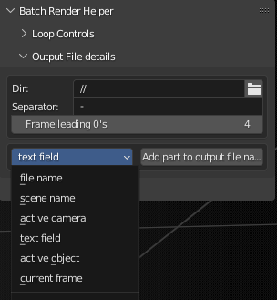

* The Directory will be the folder your renders are saved to and can be entered directly as text or through the folder icon.(*Note if you enter a directory manually this add-on does not verify the folder exists prior to attempting renders and may cause an error if the directory does not exist or user permisssions do not allow access to the directory.)
* The Separator field allows the user to define a character to split fields with when creating a file name.(*Note special characters that cannot be used in filenames are not filtered out and could cause errors in operation.)
* The frame leading 0's count allows a user defined quantity of leading 0's for the frame count.
* The enumerated list dropdown contains some predefined options for convenience to be added to build your file name. These include:
    * text field - Where you can type any text you desire.(*Note special characters that cannot be used in filenames are not filtered out and could cause errors in operation.)
    * file name - Current blend filename stripped of .blend extention.
    * scene name - Will automatically update to the name of whichever scene is being rendered.
    * active camera - Will automatically update to whichever camera is active for the specific render frame including cameras bound to markers.
    * active object - Will update to the active object per scene.
    * current frame - Will update per scene and frame range to the frame being rendered.
* Fields will be combined in sequence top to bottom to create a full file path and filename.

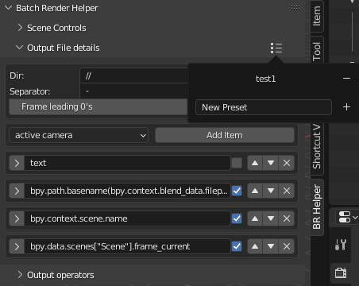

* Presets have been added as of version (0.0.7) to enable saving the fields added to create the file name structure. If for example you desire to always include the file name, the active scene name, and active camera name these can be save in order as a preset to be quickly added in another file.

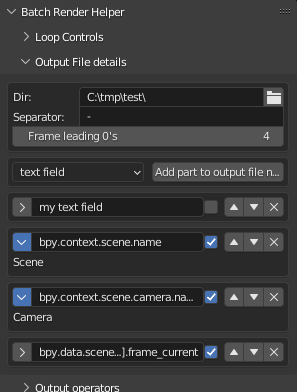

* When adding fields to create a file name structure you will notice a small checkbox. This is used internally to determine the exact text to be used when creating the file name and will be discussed further in the advanced operation section. For user convenience these are already set as enabled for all items except the text field option and may be left alone.

[Back to Contents](#contents)

# Testing Output

The Test output function allows you to verify all filenames that will be used prior to any render.

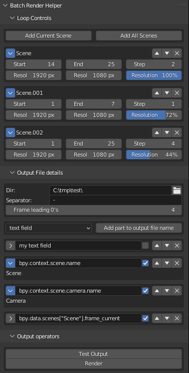

Use the operator then simply open a text editor window and use the drop down selection to view/review the generated file name format.

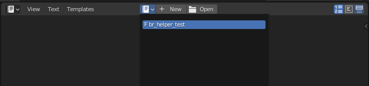

```txt
C:\tmp\test\my text field-Scene-Camera.001-0014.png
C:\tmp\test\my text field-Scene-Camera.001-0016.png
C:\tmp\test\my text field-Scene-Camera.001-0018.png
C:\tmp\test\my text field-Scene-Camera.002-0020.png
C:\tmp\test\my text field-Scene-Camera.002-0022.png
C:\tmp\test\my text field-Scene-Camera.002-0024.png
C:\tmp\test\my text field-Scene.001-Camera.003-0001.png
C:\tmp\test\my text field-Scene.001-Camera.003-0002.png
C:\tmp\test\my text field-Scene.001-Camera.003-0003.png
C:\tmp\test\my text field-Scene.001-Camera.003-0004.png
C:\tmp\test\my text field-Scene.001-Camera.003-0005.png
C:\tmp\test\my text field-Scene.001-Camera.003-0006.png
C:\tmp\test\my text field-Scene.001-Camera.003-0007.png
C:\tmp\test\my text field-Scene.002-Camera.006-0001.png
C:\tmp\test\my text field-Scene.002-Camera.006-0005.png
C:\tmp\test\my text field-Scene.002-Camera.006-0009.png
C:\tmp\test\my text field-Scene.002-Camera.007-0013.png
C:\tmp\test\my text field-Scene.002-Camera.007-0017.png
C:\tmp\test\my text field-Scene.002-Camera.008-0021.png
C:\tmp\test\my text field-Scene.002-Camera.008-0025.png
```

You can now see that each scene, camera, and frame range are properly identified (even though the selections were made in a specific scene) as well as the default file directory. If you identify something you wish to change simply add, modify or remove in the panel in the 3d viewport and verify by running the test again overwriting the existing text editor file.

[Back to Contents](#contents)

# Performing Render

Once satisfied with the filenames shown in the test use the `Render` operator to begin rendering.

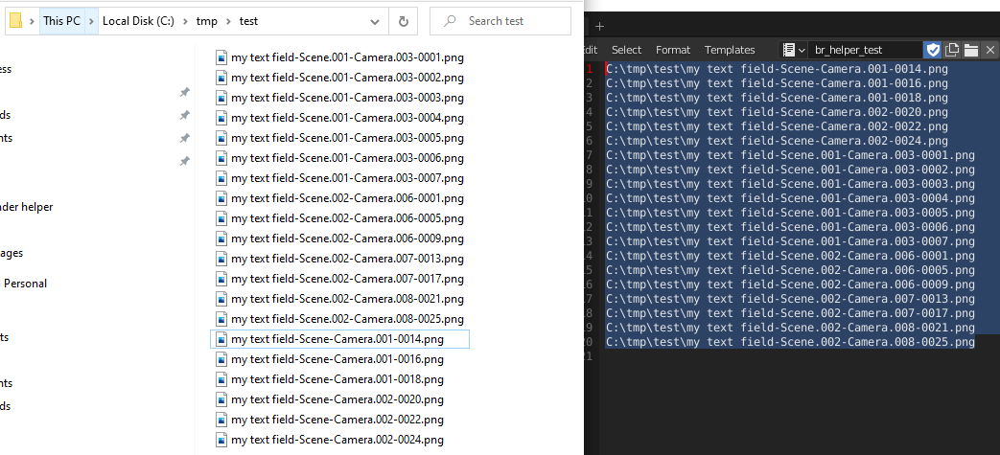

With the exception of the operating system sorting you should note no difference in the final file names and the names generated during the test.

[Back to Contents](#contents)

# Intermediate Operation

# Background Rendering

Due to inherent security risks associated with running batch commands I have intentionally left this as only a text data block generation that you may choose to copy and create a batch file from.

The Gen Batch File Commands operator located in the Output Operators panel will create the required commands to automate background rendering from a batch file. This specific setup is not fully optimized and does not contain all available options for [command line rendering]( https://docs.blender.org/manual/en/dev/advanced/command_line/arguments.html). Once generated the entire text block can be saved as a `.bat` file. It is important to note that if you are using relative file paths the batch file should be saved in the same directory as your `.blend` file. Once saved the batch file can be run without an open session of blender to perform background rendering.

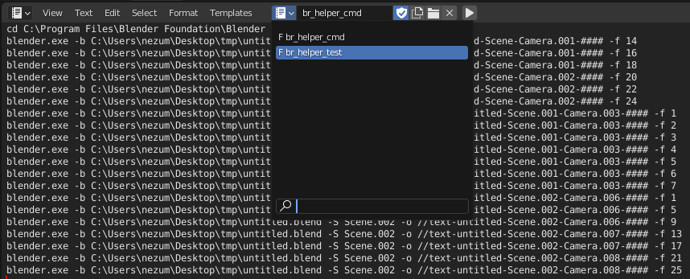

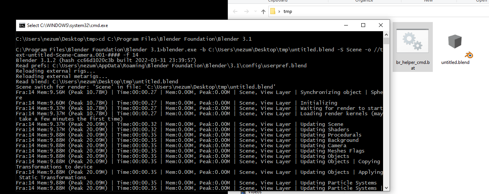

[Back to Contents](#contents)

# Advanced Operation

You may find yourself desiring a field input that is not in the pre-defined list provided. This add-on was set up to allow for some flexibility in capturing and evaluating blender's datapaths.

As an example we will capture and evaluate the scene's render engine setting.

We begin by adding a text field to our file name options.

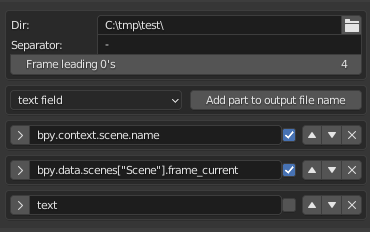

Once a field is added right mouse click over the render engine field of the properties panel and copy a full data path of a scene property to be used.

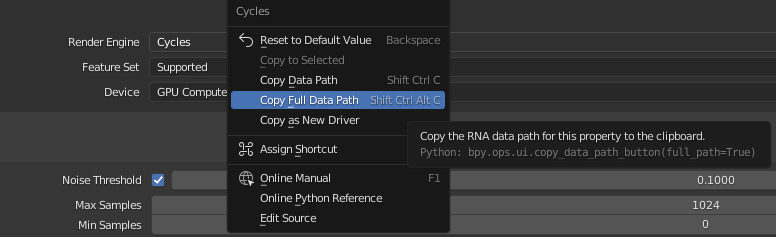

Now paste the data path into the text field < ctrl-V > replacing the default text.

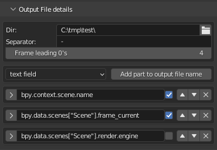

(For this example `bpy.data.scenes["Scene"].render.engine` was copied.)

Once a full data path is copied into a field; use the check box to enable evaluation of the field.

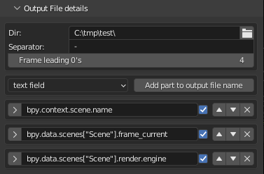

You can verify the field is properly evaluated by clicking the expand arrow to the left. If the field is properly evaluated the selected property should show directly below in a user friendly format similar to where the data path was copied from.

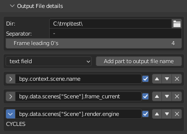

Lets run a quick test.

```text
C:\tmp\test\Scene-0014-CYCLES.png
C:\tmp\test\Scene-0016-CYCLES.png
C:\tmp\test\Scene-0018-CYCLES.png
C:\tmp\test\Scene-0020-CYCLES.png
C:\tmp\test\Scene-0022-CYCLES.png
C:\tmp\test\Scene-0024-CYCLES.png
C:\tmp\test\Scene.001-0001-BLENDER_WORKBENCH.png
C:\tmp\test\Scene.001-0002-BLENDER_WORKBENCH.png
C:\tmp\test\Scene.001-0003-BLENDER_WORKBENCH.png
C:\tmp\test\Scene.001-0004-BLENDER_WORKBENCH.png
C:\tmp\test\Scene.001-0005-BLENDER_WORKBENCH.png
C:\tmp\test\Scene.001-0006-BLENDER_WORKBENCH.png
C:\tmp\test\Scene.001-0007-BLENDER_WORKBENCH.png
C:\tmp\test\Scene.002-0001-BLENDER_EEVEE.png
C:\tmp\test\Scene.002-0005-BLENDER_EEVEE.png
C:\tmp\test\Scene.002-0009-BLENDER_EEVEE.png
C:\tmp\test\Scene.002-0013-BLENDER_EEVEE.png
C:\tmp\test\Scene.002-0017-BLENDER_EEVEE.png
C:\tmp\test\Scene.002-0021-BLENDER_EEVEE.png
C:\tmp\test\Scene.002-0025-BLENDER_EEVEE.png
```

We have now added and evaluated the render engine setting for each of our scenes. Furthermore, we can see that each scene is currently set to a different render engine and fortunately go to our scene panels and correct these settings prior to render.

[Back to Contents](#contents)

# Potential Gotcha's:


Some fields like the active camera selection will show a pointer address instead of a simple string name. This is not an error as the field is a pointer to the object not the objects name. 

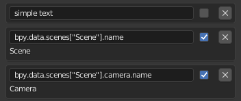

To correct this simply add '.name' to the end of the data path previously copied the underlying evaluated property now displays the intended result.

[Back to Contents](#contents)

# Change Log:

"version": (0, 0, 2)
* Included frame step control option.
* Added expand/collapse to loop and file name part sections.
* Converted Scene name to label in loop controls section.

"version": (0, 0, 3)
* Referenced scenes as pointers in loop control eliminating the need for several variables and coding.
* This assists in preventing errors if the user modifies the scene name.
* This also removed the utility of having a check box to force full frame range and step count of 1 as the properties are now directly modified from the panel.

"version": (0, 0, 4)
* Added controls to re-order items in collection properties.
* Merge similar operator code blocks utilizing operator variables to maintain functionality.
* Added control for # leading 0's of frame counter.
* Prevent adding duplicate scenes.

"version": (0, 0, 5)
* Fixed bug preventing removing output filename parts.
* Added enumerated list with common fields for output filename parts.
* Initialized output filename parts to include current frame but allowed its removal.

"version": (0, 0, 6)
* Added scene render resolutions to loop controls panel.
* Updating documentation.

"version": (0, 0, 7)
* Added optional UI_list panel layout available through add-on preferences.

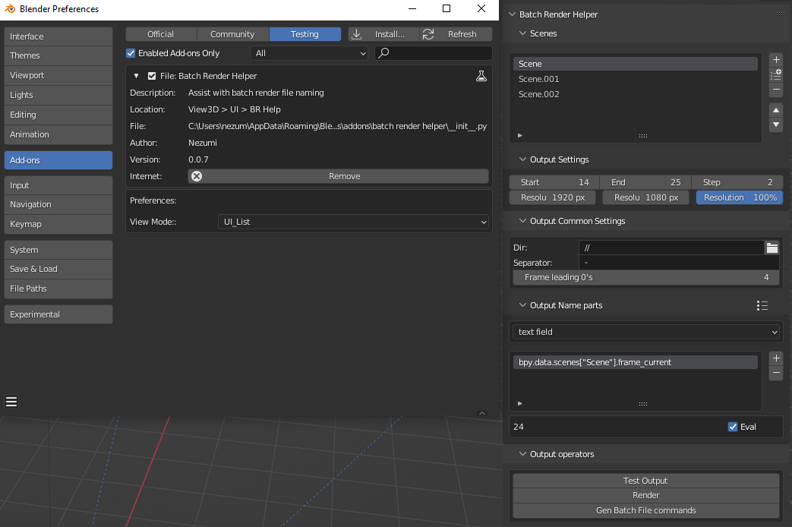

* Added Presets for name part section for convenience of repeated naming conventions.

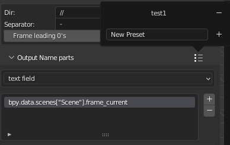

* Added text commands for batch file to background render.
* Updated code for above changes.

[Back to Contents](#contents)
